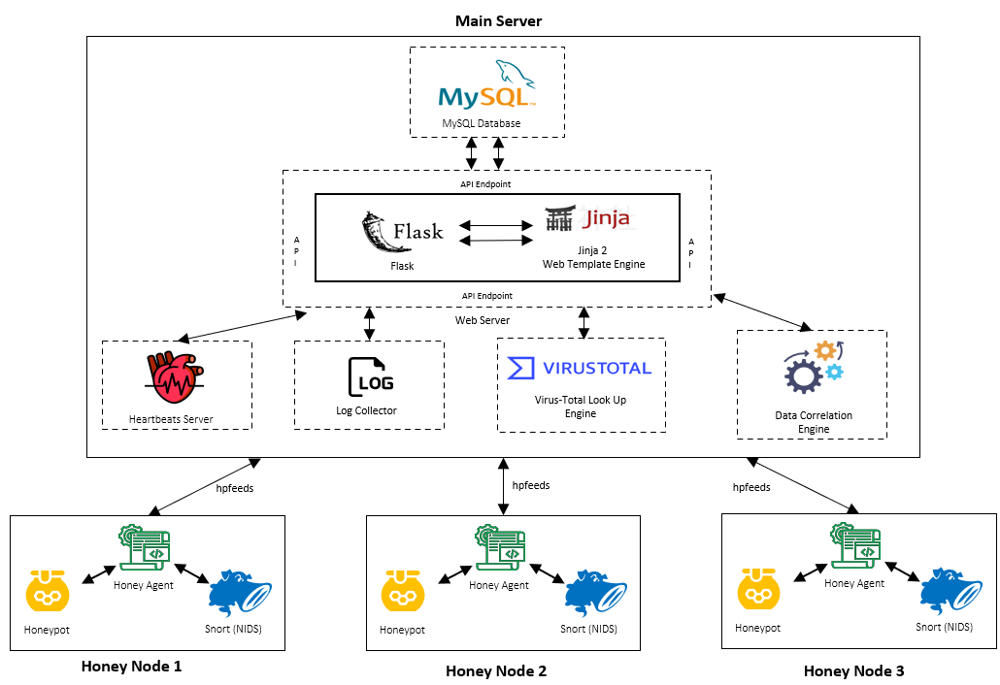

<!--
*** Thanks for checking out the Best-README-Template. If you have a suggestion
*** that would make this better, please fork the repo and create a pull request
*** or simply open an issue with the tag "enhancement".
*** Thanks again! Now go create something AMAZING! :D
-->

<!-- PROJECT LOGO -->

<!-- TABLE OF CONTENTS -->

  
Table of Contents

  <ol>
    <li><a href="#about-the-project">About The Project</a></li>
    <li><a href="#problem-statements">Problem Statements</a></li>
    <li><a href="#proposed solutionse">Proposed Solutions</a></li>
    <li><a href="#usage">Usage</a></li>
    <li><a href="#contributing">Contributing</a></li>
    <li><a href="#license">License</a></li>
    <li><a href="#contact">Contact</a></li>
    <li><a href="#acknowledgements">Acknowledgements</a></li>
  </ol>

<!-- ABOUT THE PROJECT -->
## About The Project

HoneyIDS is an internal attack and intrusion detection framework that makes use of distributed honeypot nodes. It meshes honeypots, a deception-based technology, with a traditional open-source NIDS to tackle network intrusion detection in a distinctive way. 

### Problem Statements 

### Proposed Solutions

### Features

* Streamlined deployment mechanism for easy honey nodes deployment
* Full stack web gui for easy management and pleasant user experience 
* Real-time log collection
* Data correlation to help the user get a high-level abstracted view of the attacks happening inside the network ecosystem
* Real-time status monitoring of honey nodes deployed    

### System Architecture

    

### Built With

The following technologies are used in this project:

* [Flask](https://flask.palletsprojects.com)
* [MySQL](https://www.mysql.com)
* [Hp-Feeds](https://hpfeeds.org/)
* [Snort](https://www.snort.org/)

Open source honeypots used:

* [Cowrie](https://github.com/cowrie/cowrie)
* [Dionaea](https://github.com/DinoTools/dionaea)
* [Shockpot](https://github.com/pwnlandia/shockpot)
* [Drupot](https://github.com/d1str0/drupot)
* [Elastichoney](https://github.com/jordan-wright/elastichoney)
* [Sticky Elephant](https://github.com/betheroot/sticky_elephant)
* [Wordpot](https://github.com/gbrindisi/wordpot)

Frontend template used:

* [AdminLTE](https://github.com/ColorlibHQ/AdminLTE)

<!-- USAGE EXAMPLES -->
## Usage
#### Login
Users can sign in to the HoneyIDS web applications using the following default credentials:

| Username | Password |
|----------|----------|
| admin_1  | admin    |
| admin_2  | admin    | 

#### Dashboard 

#### Data Correlation
https://user-images.githubusercontent.com/29125030/125169393-86780780-e1dc-11eb-99e8-9ddcf48030e6.mp4

#### Deployment 

https://user-images.githubusercontent.com/29125030/125169432-b6270f80-e1dc-11eb-8abe-2bf3988fb47a.mp4

#### Nodes

#### Logs

https://user-images.githubusercontent.com/29125030/125169454-c9d27600-e1dc-11eb-8257-acee1f266012.mp4

<!-- CONTRIBUTING -->
## Contributing

Contributions are what make the open source community such an amazing place to be learn, inspire, and create. Any contributions you make are **greatly appreciated**.

1. Fork the Project
2. Create your Feature Branch (`git checkout -b feature/AmazingFeature`)
3. Commit your Changes (`git commit -m 'Add some AmazingFeature'`)
4. Push to the Branch (`git push origin feature/AmazingFeature`)
5. Open a Pull Request

<!-- CONTACT -->
## Contact
Please contact us anytime for  
1. Help regarding deployment  
2. Full documenation and report of the project  
3. Any questions regarding the project  

Derek, Thein Than Zaw - derekdewreck@gmail.com  
Jimmy, Zhang Rongtao - zql2532666@gmail.com  

Project Link: [https://github.com/zql2532666/HoneyIDS](https://github.com/zql2532666/HoneyIDS) 
Youtube Channel: https://www.youtube.com/channel/UCVIpT8lazmAvDrK9LE9H3GA/featured

<!-- ACKNOWLEDGEMENTS -->
## Acknowledgements
* [Cowrie](https://github.com/cowrie/cowrie)
* [Dionaea](https://github.com/DinoTools/dionaea)
* [Shockpot](https://github.com/pwnlandia/shockpot)
* [Drupot](https://github.com/d1str0/drupot)
* [Elastichoney](https://github.com/jordan-wright/elastichoney)
* [Sticky Elephant](https://github.com/betheroot/sticky_elephant)
* [Wordpot](https://github.com/gbrindisi/wordpot)
* [AdminLTE](https://github.com/ColorlibHQ/AdminLTE)

## Poster

